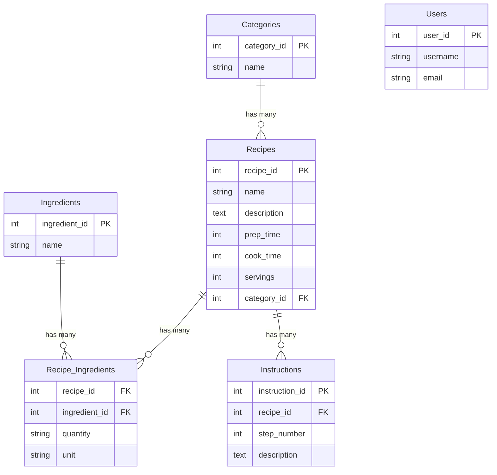

# Recipes manager

## DB Design

```mermaid
erDiagram
    Categories {
        int category_id PK
        string name
    }

    Recipes {
        int recipe_id PK
        string name
        text description
        int prep_time
        int cook_time
        int servings
        int category_id FK
    }

    Ingredients {
        int ingredient_id PK
        string name
    }

    Recipe_Ingredients {
        int recipe_id FK
        int ingredient_id FK
        string quantity
        string unit
    }

    Instructions {
        int instruction_id PK
        int recipe_id FK
        int step_number
        text description
    }

    Users {
        int user_id PK
        string username
        string email
    }

    Categories ||--o{ Recipes : "has many"
    Recipes ||--o{ Recipe_Ingredients : "has many"
    Ingredients ||--o{ Recipe_Ingredients : "has many"
    Recipes ||--o{ Instructions : "has many"
```
